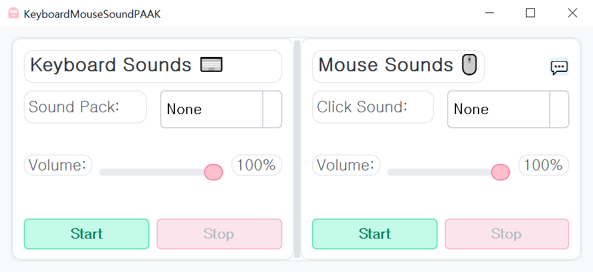

# KeyboardMouseSoundPAAK ⌨️🖱️🔊

An application that plays delightful sound effects when you type on the keyboard or click the mouse. You can select various sound packs and click sounds, and adjust the volume. 😄

## Quick Links 🔗

- [⬇️ Download Latest Release](https://github.com/htpaak/KeyboardMouseSoundPAAK/releases/latest)
- [⭐ GitHub Repository](https://github.com/htpaak/KeyboardMouseSoundPAAK)
- [💬 Feedback & Discussions](https://github.com/htpaak/KeyboardMouseSoundPAAK/discussions)

## Key Features 🌟

*   **Keyboard Sound Effects:**
    *   Selectable keyboard sound packs (based on the `src/keyboard` folder)
    *   Plays sounds on key press and release
    *   Plays different sounds based on key row position (GENERIC_R0 ~ R4)
    *   Volume control
*   **Mouse Click Sound Effects:**
    *   Selectable mouse click sounds (based on the `src/mouse` folder)
    *   Plays sound on mouse click
    *   Volume control
*   **Intuitive GUI:** User interface based on PyQt5

## Demo 📸

## System Requirements 💻

*   **Operating System:** Windows

## Installation 🚀

1. Download the latest release from the [Releases Page](https://github.com/htpaak/KeyboardMouseSoundPAAK/releases/latest)
2. Download the `KeyboardMouseSoundPAAK_vX.Y.Z.exe` file (where X.Y.Z is the version number).
3. That's it! No installation needed. Simply run the downloaded `.exe` file.

## How to Use 📖

1.  Run the application.
2.  **Keyboard Sounds** section:
    *   Select the desired keyboard sound pack from the `Sound Pack` combobox. (Disabled if `None` is selected)
    *   Adjust the keyboard sound volume using the `Volume` slider.
    *   Click the `Start` button to activate the keyboard sound effects.
    *   Click the `Stop` button to deactivate.
3.  **Mouse Sounds** section:
    *   Select the desired mouse click sound from the `Click Sound` combobox. (Disabled if `None` is selected)
    *   Adjust the mouse sound volume using the `Volume` slider.
    *   Click the `Start` button to activate the mouse sound effects.
    *   Click the `Stop` button to deactivate.
4.  Now, when you type on the keyboard or click the mouse, the configured sounds will play.
5.  **System Tray**:
    *   Pressing the close (X) button on the application window will hide the window and minimize it to a system tray icon, allowing it to continue running in the background.
    *   Double-click the tray icon or select "Show" from the right-click context menu to reopen the window.
    *   Select "Exit" from the tray icon's right-click context menu to completely close the application.

## Development Information 👨‍💻

*   **GUI Framework:** PyQt5
*   **Key/Mouse Input Detection:** pynput
*   **Sound Playback:** pygame.mixer
*   **Logging:** Python `logging` module (saved in the `logs` folder)
*   **Build Script:** `build.bat` (presumably using PyInstaller)

## Acknowledgments 🙏

*   Thanks to all the potential contributors who might help with development in the future! 💖
*   Special thanks to the amazing open-source libraries (`PyQt5`, `pynput`, `pygame`) that make this project possible! FOSS rocks! 🤘