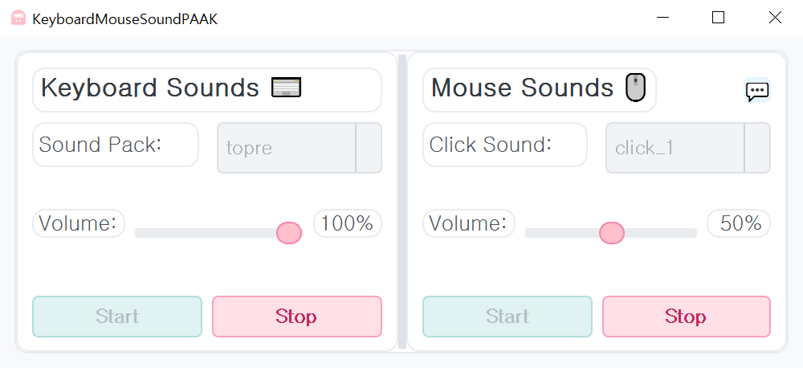

# KeyboardMouseSoundPAAK ⌨️🖱️🔊

키보드 타이핑 및 마우스 클릭 시 즐거운 사운드 효과를 재생하는 애플리케이션입니다. 다양한 사운드 팩과 클릭 사운드를 선택하고 볼륨을 조절할 수 있습니다. 😄

## Quick Links 🔗

- [⬇️ Download Latest Release](https://github.com/htpaak/KeyboardMouseSoundPAAK/releases/latest)
- [⭐ GitHub Repository](https://github.com/htpaak/KeyboardMouseSoundPAAK)
- [💬 Feedback & Discussions](https://github.com/htpaak/KeyboardMouseSoundPAAK/discussions)

## Key Features 🌟

*   **키보드 사운드 효과:**
    *   다양한 키보드 사운드 팩 선택 가능 (`src/keyboard` 폴더 기반)
    *   키 누름(press) 및 뗌(release) 시 사운드 재생
    *   키 위치(행)에 따른 다른 사운드 재생 (GENERIC_R0 ~ R4)
    *   볼륨 조절 기능
*   **마우스 클릭 사운드 효과:**
    *   다양한 마우스 클릭 사운드 선택 가능 (`src/mouse` 폴더 기반)
    *   마우스 클릭 시 사운드 재생
    *   볼륨 조절 기능
*   **직관적인 GUI:** PyQt5 기반의 사용자 인터페이스 제공

## Demo 📸

## System Requirements 💻

*   **운영체제:** Windows

## Installation 🚀

1. Download the latest release from the [Releases Page](https://github.com/htpaak/KeyboardMouseSoundPAAK/releases/latest)
2. Download the `KeyboardMouseSoundPAAK_vX.Y.Z.exe` file (where X.Y.Z is the version number).
3. That's it! No installation needed. Simply run the downloaded `.exe` file.

## How to Use 📖

1.  애플리케이션을 실행합니다.
2.  **Keyboard Sounds** 섹션:
    *   `Sound Pack` 콤보박스에서 원하는 키보드 사운드 팩을 선택합니다. (`None` 선택 시 비활성화)
    *   `Volume` 슬라이더를 조절하여 키보드 사운드 크기를 설정합니다.
    *   `Start` 버튼을 클릭하여 키보드 사운드 효과를 활성화합니다.
    *   `Stop` 버튼을 클릭하여 비활성화합니다.
3.  **Mouse Sounds** 섹션:
    *   `Click Sound` 콤보박스에서 원하는 마우스 클릭 사운드를 선택합니다. (`None` 선택 시 비활성화)
    *   `Volume` 슬라이더를 조절하여 마우스 사운드 크기를 설정합니다.
    *   `Start` 버튼을 클릭하여 마우스 사운드 효과를 활성화합니다.
    *   `Stop` 버튼을 클릭하여 비활성화합니다.
4.  이제 키보드를 타이핑하거나 마우스를 클릭하면 설정된 사운드가 재생됩니다.

## Development Information 👨‍💻

*   **GUI 프레임워크:** PyQt5
*   **키/마우스 입력 감지:** pynput
*   **사운드 재생:** pygame.mixer
*   **로깅:** Python `logging` 모듈 (`logs` 폴더에 저장)
*   **빌드 스크립트:** `build.bat` (PyInstaller 사용 추정)

## Acknowledgments 🙏

*   Thanks to all the potential contributors who might help with development in the future! 💖
*   Special thanks to the amazing open-source libraries (`PyQt5`, `pynput`, `pygame`) that make this project possible! FOSS rocks! 🤘